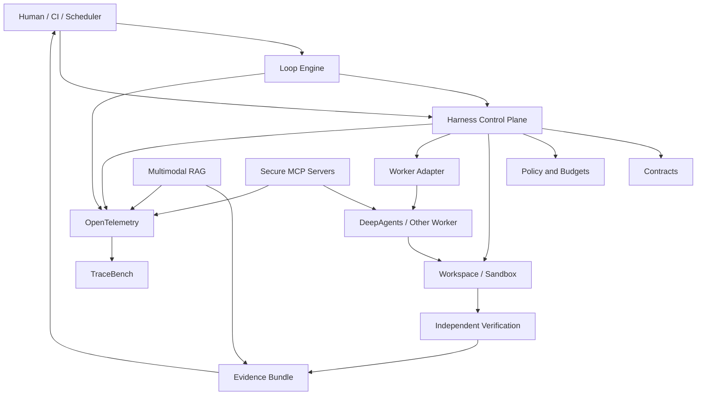

# Platform Architecture

## Layered model

## Stable platform interfaces

- `RunContract`
- `WorkerCapabilities`
- `WorkerRequest`
- `WorkerEvent`
- `WorkerResult`
- `PolicyDecision`
- `VerificationResult`
- `EvidenceBundle`
- `EvaluationResult`
- `TraceEvent`

## Ownership rule

Contracts may be imported by every package.

Contracts must not import application, framework, model-provider, database, or UI packages.
